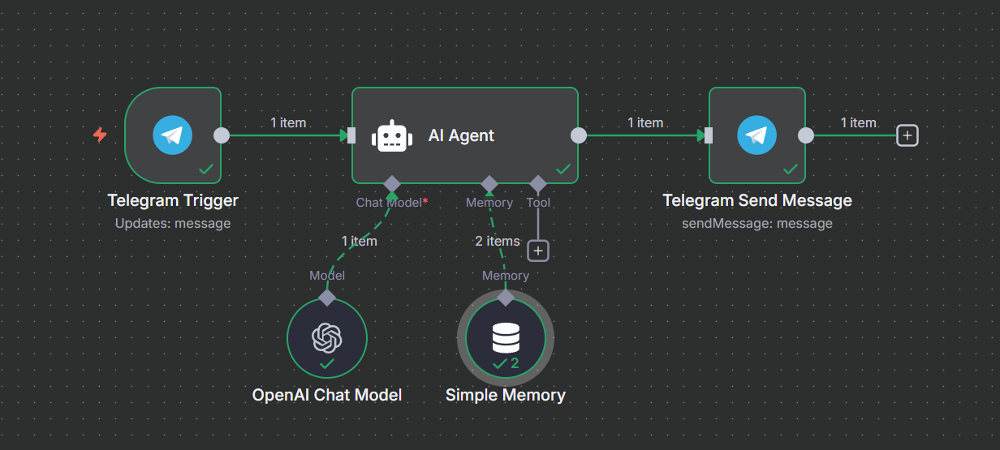

# Smart Chef - AI-Powered Telegram Recipe Bot

Smart Chef is an AI-enabled Telegram bot designed to generate customized recipes from the ingredients users have on hand. By leveraging advanced language models, the bot provides simple, step-by-step cooking instructions directly in Telegram, making meal preparation easier and more creative.

## Features

- Input your available ingredients through Telegram chat
- AI generates tailored recipes based on input
- Stepwise recipe instructions for easy cooking
- Memory feature to maintain conversational context
- Built using n8n workflow automation and OpenAI GPT-4 model
### Sample Usage

## Setup Instructions

1. Create a Telegram bot via BotFather and get your Bot API token.
2. Obtain an API key for OpenAI.
3. Import the provided n8n workflow JSON into your n8n instance.
4. Configure the Telegram and OpenAI credentials in the workflow nodes.
5. Activate the workflow.
6. Start conversing with your Telegram bot by sending ingredients.

## Technologies Used

- Telegram Bot API
- n8n workflow automation
- OpenAI GPT-4 language model
- Langchain nodes for AI integration

## Contribution

Contributions and feedback are welcome! Please open issues or pull requests.

## License

MIT License

